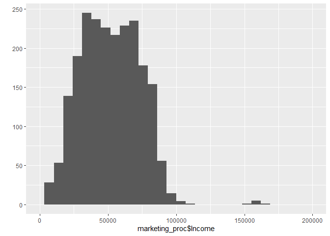
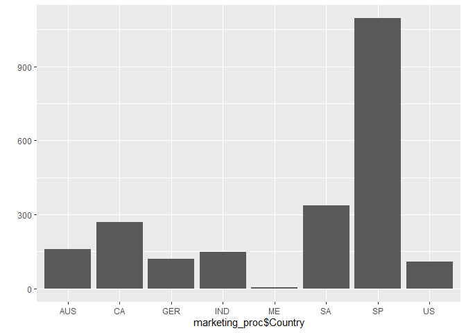
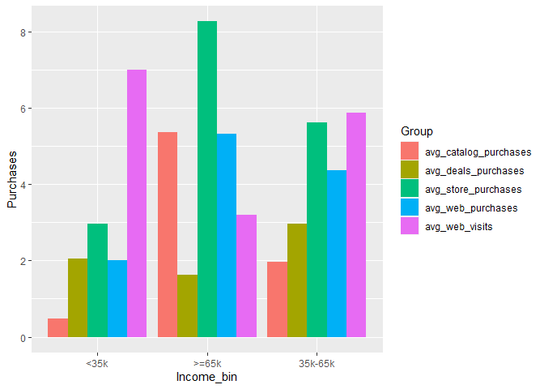

marketing\_data\_eda
================
Kevin
30 May 2021

``` r
library(tidyverse)
```

    ## -- Attaching packages --------------------------------------- tidyverse 1.3.1 --

    ## v ggplot2 3.3.3     v purrr   0.3.4
    ## v tibble  3.1.1     v dplyr   1.0.6
    ## v tidyr   1.1.3     v stringr 1.4.0
    ## v readr   1.4.0     v forcats 0.5.1

    ## -- Conflicts ------------------------------------------ tidyverse_conflicts() --
    ## x dplyr::filter() masks stats::filter()
    ## x dplyr::lag()    masks stats::lag()

``` r
library(data.table)
```

    ## 
    ## Attaching package: 'data.table'

    ## The following objects are masked from 'package:dplyr':
    ## 
    ##     between, first, last

    ## The following object is masked from 'package:purrr':
    ## 
    ##     transpose

``` r
library(lubridate)
```

    ## 
    ## Attaching package: 'lubridate'

    ## The following objects are masked from 'package:data.table':
    ## 
    ##     hour, isoweek, mday, minute, month, quarter, second, wday, week,
    ##     yday, year

    ## The following objects are masked from 'package:base':
    ## 
    ##     date, intersect, setdiff, union

``` r
library(corrplot)
```

    ## corrplot 0.88 loaded

``` r
marketing_raw <- fread('data/marketing_data.csv', colClasses = c('Education'='factor', 'Marital_Status'='factor',
                                                                 'Country'='factor'))
head(marketing_raw)
```

    ##       ID Year_Birth  Education Marital_Status      Income Kidhome Teenhome
    ## 1:  1826       1970 Graduation       Divorced $84,835.00        0        0
    ## 2:     1       1961 Graduation         Single $57,091.00        0        0
    ## 3: 10476       1958 Graduation        Married $67,267.00        0        1
    ## 4:  1386       1967 Graduation       Together $32,474.00        1        1
    ## 5:  5371       1989 Graduation         Single $21,474.00        1        0
    ## 6:  7348       1958        PhD         Single $71,691.00        0        0
    ##    Dt_Customer Recency MntWines MntFruits MntMeatProducts MntFishProducts
    ## 1:     6/16/14       0      189       104             379             111
    ## 2:     6/15/14       0      464         5              64               7
    ## 3:     5/13/14       0      134        11              59              15
    ## 4:  05-11-2014       0       10         0               1               0
    ## 5:  04-08-2014       0        6        16              24              11
    ## 6:     3/17/14       0      336       130             411             240
    ##    MntSweetProducts MntGoldProds NumDealsPurchases NumWebPurchases
    ## 1:              189          218                 1               4
    ## 2:                0           37                 1               7
    ## 3:                2           30                 1               3
    ## 4:                0            0                 1               1
    ## 5:                0           34                 2               3
    ## 6:               32           43                 1               4
    ##    NumCatalogPurchases NumStorePurchases NumWebVisitsMonth AcceptedCmp3
    ## 1:                   4                 6                 1            0
    ## 2:                   3                 7                 5            0
    ## 3:                   2                 5                 2            0
    ## 4:                   0                 2                 7            0
    ## 5:                   1                 2                 7            1
    ## 6:                   7                 5                 2            0
    ##    AcceptedCmp4 AcceptedCmp5 AcceptedCmp1 AcceptedCmp2 Response Complain
    ## 1:            0            0            0            0        1        0
    ## 2:            0            0            0            1        1        0
    ## 3:            0            0            0            0        0        0
    ## 4:            0            0            0            0        0        0
    ## 5:            0            0            0            0        1        0
    ## 6:            0            0            0            0        1        0
    ##    Country
    ## 1:      SP
    ## 2:      CA
    ## 3:      US
    ## 4:     AUS
    ## 5:      SP
    ## 6:      SP

## About data -

Data is from a iFood CRM(mentioned in kaggle discussions). It is a
Brazilian food delivery platform. Data is of customers who made purchase
in the last 100 days.

## Classes of variables -

1)  Customer Attributes
2)  Amount spent on different product groups
3)  Number of Purchases through Channels and visits
4)  Success after each campaign

The means of AcceptedCmp and Response and Complain will give the
percentage of 1’s in the columns. Most AcceptedCmp have a 7% success
rate.

``` r
marketing_proc <- marketing_raw %>% 
  mutate(Dt_Customer = mdy(Dt_Customer),  
         Income = as.double(str_replace_all(Income, "[$,]", "")),
         Age=2014-Year_Birth,
         People_at_home = if_else(Marital_Status %in% c('Married','Together'), Kidhome+Teenhome+2, Kidhome+Teenhome+1),
         Age_bin = case_when(Age<35 ~ '<35',
                             Age<45 ~ '35-44',
                             Age<60 ~ '45-59',
                             TRUE ~ '>=60'),
         Income_bin = case_when(Income<35000 ~ '<35k',
                                Income<65000 ~ '35k-65k',
                                TRUE ~ '>=65k'),
         Response=case_when((Response==1 | AcceptedCmp1==1 | AcceptedCmp2==1 | 
                              AcceptedCmp3==1 | AcceptedCmp4==1 | AcceptedCmp5==1) ~ 1,
                            TRUE ~ 0)) 
# Assuming data is extracted around 30th June 2014
# Assuming parents of customers do not stay with them
summary(marketing_proc)
```

    ##        ID          Year_Birth        Education     Marital_Status
    ##  Min.   :    0   Min.   :1893   2n Cycle  : 203   Married :864   
    ##  1st Qu.: 2828   1st Qu.:1959   Basic     :  54   Together:580   
    ##  Median : 5458   Median :1970   Graduation:1127   Single  :480   
    ##  Mean   : 5592   Mean   :1969   Master    : 370   Divorced:232   
    ##  3rd Qu.: 8428   3rd Qu.:1977   PhD       : 486   Widow   : 77   
    ##  Max.   :11191   Max.   :1996                     Alone   :  3   
    ##                                                   (Other) :  4   
    ##      Income          Kidhome          Teenhome       Dt_Customer        
    ##  Min.   :  1730   Min.   :0.0000   Min.   :0.0000   Min.   :2012-07-30  
    ##  1st Qu.: 35303   1st Qu.:0.0000   1st Qu.:0.0000   1st Qu.:2013-01-16  
    ##  Median : 51382   Median :0.0000   Median :0.0000   Median :2013-07-08  
    ##  Mean   : 52247   Mean   :0.4442   Mean   :0.5062   Mean   :2013-07-10  
    ##  3rd Qu.: 68522   3rd Qu.:1.0000   3rd Qu.:1.0000   3rd Qu.:2013-12-30  
    ##  Max.   :666666   Max.   :2.0000   Max.   :2.0000   Max.   :2014-06-29  
    ##  NA's   :24                                                             
    ##     Recency         MntWines         MntFruits     MntMeatProducts 
    ##  Min.   : 0.00   Min.   :   0.00   Min.   :  0.0   Min.   :   0.0  
    ##  1st Qu.:24.00   1st Qu.:  23.75   1st Qu.:  1.0   1st Qu.:  16.0  
    ##  Median :49.00   Median : 173.50   Median :  8.0   Median :  67.0  
    ##  Mean   :49.11   Mean   : 303.94   Mean   : 26.3   Mean   : 166.9  
    ##  3rd Qu.:74.00   3rd Qu.: 504.25   3rd Qu.: 33.0   3rd Qu.: 232.0  
    ##  Max.   :99.00   Max.   :1493.00   Max.   :199.0   Max.   :1725.0  
    ##                                                                    
    ##  MntFishProducts  MntSweetProducts  MntGoldProds    NumDealsPurchases
    ##  Min.   :  0.00   Min.   :  0.00   Min.   :  0.00   Min.   : 0.000   
    ##  1st Qu.:  3.00   1st Qu.:  1.00   1st Qu.:  9.00   1st Qu.: 1.000   
    ##  Median : 12.00   Median :  8.00   Median : 24.00   Median : 2.000   
    ##  Mean   : 37.53   Mean   : 27.06   Mean   : 44.02   Mean   : 2.325   
    ##  3rd Qu.: 50.00   3rd Qu.: 33.00   3rd Qu.: 56.00   3rd Qu.: 3.000   
    ##  Max.   :259.00   Max.   :263.00   Max.   :362.00   Max.   :15.000   
    ##                                                                      
    ##  NumWebPurchases  NumCatalogPurchases NumStorePurchases NumWebVisitsMonth
    ##  Min.   : 0.000   Min.   : 0.000      Min.   : 0.00     Min.   : 0.000   
    ##  1st Qu.: 2.000   1st Qu.: 0.000      1st Qu.: 3.00     1st Qu.: 3.000   
    ##  Median : 4.000   Median : 2.000      Median : 5.00     Median : 6.000   
    ##  Mean   : 4.085   Mean   : 2.662      Mean   : 5.79     Mean   : 5.317   
    ##  3rd Qu.: 6.000   3rd Qu.: 4.000      3rd Qu.: 8.00     3rd Qu.: 7.000   
    ##  Max.   :27.000   Max.   :28.000      Max.   :13.00     Max.   :20.000   
    ##                                                                          
    ##   AcceptedCmp3      AcceptedCmp4      AcceptedCmp5      AcceptedCmp1    
    ##  Min.   :0.00000   Min.   :0.00000   Min.   :0.00000   Min.   :0.00000  
    ##  1st Qu.:0.00000   1st Qu.:0.00000   1st Qu.:0.00000   1st Qu.:0.00000  
    ##  Median :0.00000   Median :0.00000   Median :0.00000   Median :0.00000  
    ##  Mean   :0.07277   Mean   :0.07455   Mean   :0.07277   Mean   :0.06429  
    ##  3rd Qu.:0.00000   3rd Qu.:0.00000   3rd Qu.:0.00000   3rd Qu.:0.00000  
    ##  Max.   :1.00000   Max.   :1.00000   Max.   :1.00000   Max.   :1.00000  
    ##                                                                         
    ##   AcceptedCmp2        Response         Complain           Country    
    ##  Min.   :0.00000   Min.   :0.0000   Min.   :0.000000   SP     :1095  
    ##  1st Qu.:0.00000   1st Qu.:0.0000   1st Qu.:0.000000   SA     : 337  
    ##  Median :0.00000   Median :0.0000   Median :0.000000   CA     : 268  
    ##  Mean   :0.01339   Mean   :0.2719   Mean   :0.009375   AUS    : 160  
    ##  3rd Qu.:0.00000   3rd Qu.:1.0000   3rd Qu.:0.000000   IND    : 148  
    ##  Max.   :1.00000   Max.   :1.0000   Max.   :1.000000   GER    : 120  
    ##                                                        (Other): 112  
    ##       Age         People_at_home    Age_bin           Income_bin       
    ##  Min.   : 18.00   Min.   :1.000   Length:2240        Length:2240       
    ##  1st Qu.: 37.00   1st Qu.:2.000   Class :character   Class :character  
    ##  Median : 44.00   Median :3.000   Mode  :character   Mode  :character  
    ##  Mean   : 45.19   Mean   :2.595                                        
    ##  3rd Qu.: 55.00   3rd Qu.:3.000                                        
    ##  Max.   :121.00   Max.   :5.000                                        
    ## 

### Response is 1 if any of the accepted or response variables is 1. Thus, response rate is mean of that column, 27%

## Customer Attributes

### Age

``` r
qplot(marketing_proc$Age, geom='histogram', xlim=c(15,80), bins=20)
```

    ## Warning: Removed 3 rows containing non-finite values (stat_bin).

    ## Warning: Removed 2 rows containing missing values (geom_bar).

<!-- -->

Biggest customer group is in age group of 35 to 45. Few people above 100
yrs old are excluded from the view for better view.

### Education

``` r
qplot(marketing_proc$Education, geom="bar")
```

<!-- -->

Customer base seems to be atleast Graduates
    mostly

### Income

``` r
qplot(marketing_proc$Income, geom='histogram', xlim=c(0,200000))
```

    ## `stat_bin()` using `bins = 30`. Pick better value with `binwidth`.

    ## Warning: Removed 25 rows containing non-finite values (stat_bin).

    ## Warning: Removed 2 rows containing missing values (geom_bar).

<!-- -->

Income is nearly symmetrically distributed around $50000 with a few
people around $150,000 and one person with over $600,000

### Marital Status

``` r
qplot(marketing_proc$Marital_Status, geom="bar")
```

<!-- -->

Mostly Married and Together and Divorced, so consistent with the middle
aged group

### People at Home

``` r
qplot(marketing_proc$People_at_home, geom='bar')
```

<!-- -->

Mostly 2 or 3 people in a family(Mostly one person would make food
purchases for entire family)

### Country

``` r
qplot(marketing_proc$Country, geom='bar')
```

<!-- -->

Over half the customer base is from SP(possibly
    Spain)

## Purchases

### Amount spent on Fruits

``` r
qplot(marketing_proc$MntFruits, geom = 'histogram')
```

    ## `stat_bin()` using `bins = 30`. Pick better value with `binwidth`.

<!-- -->

Mostly between $0 to
    $25

### Amount spent on Fish

``` r
qplot(marketing_proc$MntFishProducts, geom = 'histogram')
```

    ## `stat_bin()` using `bins = 30`. Pick better value with `binwidth`.

<!-- -->

Mostly between $0 to
    $40

### Amount spent on Meat

``` r
qplot(marketing_proc$MntMeatProducts, geom = 'histogram')
```

    ## `stat_bin()` using `bins = 30`. Pick better value with `binwidth`.

<!-- -->

Mostly between $0 to $25 but people may spend upto $1500 on
    meat

### Amount spent on Sweets

``` r
qplot(marketing_proc$MntSweetProducts, geom = 'histogram')
```

    ## `stat_bin()` using `bins = 30`. Pick better value with `binwidth`.

<!-- -->

Mostly between $0 to
    $50

### Amount spent on Wines

``` r
qplot(marketing_proc$MntWines, geom = 'histogram')
```

    ## `stat_bin()` using `bins = 30`. Pick better value with `binwidth`.

<!-- -->

Spending on Wine is huge, even upto $1000 by
    some

### Amount spent on Gold

``` r
qplot(marketing_proc$MntGoldProds, geom = 'histogram')
```

    ## `stat_bin()` using `bins = 30`. Pick better value with `binwidth`.

<!-- -->

People are mostly spending upto $50 on gold

## Which demographic is most likely to give a response?

``` r
marketing_proc %>% 
  group_by(Age_bin) %>%
  summarise(avg_response = mean(Response)) %>%
  ggplot() +
  geom_col(aes(x=Age_bin, y=avg_response)) 
```

<!-- -->

``` r
marketing_proc %>% 
  group_by(Income_bin) %>%
  summarise(avg_response = mean(Response)) %>%
  ggplot() +
  geom_col(aes(x=Income_bin, y=avg_response)) 
```

<!-- -->

Response is significantly higher in the highest income group

``` r
marketing_proc %>% 
  group_by(People_at_home) %>%
  summarise(avg_response = mean(Response)) %>%
  ggplot() +
  geom_col(aes(x=People_at_home, y=avg_response)) 
```

<!-- -->

Highest response rate is in the below 35 age group.

``` r
marketing_proc %>% 
  group_by(Age_bin, Income_bin) %>%
  summarise(avg_response = mean(Response)) %>%
  ggplot() +
  geom_col(aes(x=Age_bin, y=avg_response, fill=Income_bin), position='dodge') 
```

    ## `summarise()` has grouped output by 'Age_bin'. You can override using the `.groups` argument.

<!-- -->

``` r
marketing_proc %>% 
  group_by(People_at_home, Income_bin) %>%
  summarise(avg_response = mean(Response)) %>%
  ggplot() +
  geom_col(aes(x=People_at_home, y=avg_response, fill=Income_bin), position='dodge') 
```

    ## `summarise()` has grouped output by 'People_at_home'. You can override using the `.groups` argument.

<!-- -->

## Correlation

``` r
fil <- marketing_proc %>% select(-c(Country, Marital_Status, Education, Dt_Customer, Age_bin, Income_bin)) %>%
  filter(!is.na(Income))
M <- cor(fil)
corrplot(M)
```

<!-- -->

## Who’s making the most purchase in each Product category?(So that we can market the right product to the right demographic)

``` r
marketing_proc %>% 
  group_by(Age_bin) %>%
  summarise(avg_fruit_expense=mean(MntFruits),
            avg_fish_expense=mean(MntFishProducts),
            avg_meat_expense=mean(MntMeatProducts),
            avg_wine_expense=mean(MntWines),
            avg_gold_expense=mean(MntGoldProds),
            avg_sweet_expense=mean(MntSweetProducts)) %>%
  gather("Group","Expense", -Age_bin) %>%
  ggplot() +
  geom_col(aes(x=Age_bin, y=Expense, fill=Group), position = 'dodge') 
```

<!-- -->

Older People spend more on Wine

``` r
marketing_proc %>% 
  group_by(Income_bin) %>%
  summarise(avg_fruit_expense=mean(MntFruits),
            avg_fish_expense=mean(MntFishProducts),
            avg_meat_expense=mean(MntMeatProducts),
            avg_wine_expense=mean(MntWines),
            avg_gold_expense=mean(MntGoldProds),
            avg_sweet_expense=mean(MntSweetProducts)) %>%
  gather("Group","Expense", -Income_bin) %>%
  ggplot() +
  geom_col(aes(x=Income_bin, y=Expense, fill=Group), position = 'dodge') 
```

<!-- -->

Richer people spend more on all product groups but especially meat and
wine

## Who uses which channel more?

``` r
marketing_proc %>% 
  group_by(People_at_home) %>%
  summarise(avg_deals_purchases=mean(NumDealsPurchases),
            avg_web_purchases=mean(NumWebPurchases),
            avg_catalog_purchases=mean(NumCatalogPurchases),
            avg_store_purchases=mean(NumStorePurchases)) %>%
  gather("Group","Purchases", -People_at_home) %>%
  ggplot() +
  geom_col(aes(x=People_at_home, y=Purchases, fill=Group), position = 'dodge') 
```

<!-- -->

When there are more people in the house, people prefer deals over
catalogs.

``` r
marketing_proc %>% 
  group_by(Income_bin) %>%
  summarise(avg_deals_purchases=mean(NumDealsPurchases),
            avg_web_purchases=mean(NumWebPurchases),
            avg_catalog_purchases=mean(NumCatalogPurchases),
            avg_store_purchases=mean(NumStorePurchases),
            avg_web_visits=mean(NumWebVisitsMonth)) %>%
  gather("Group","Purchases", -Income_bin) %>%
  ggplot() +
  geom_col(aes(x=Income_bin, y=Purchases, fill=Group), position = 'dodge') 
```

<!-- -->

People with higher income spend more but people with lower income visit
the site more.
